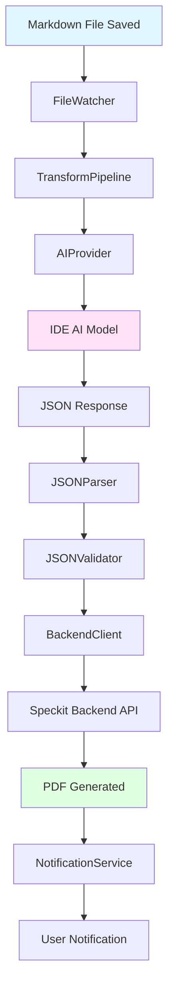
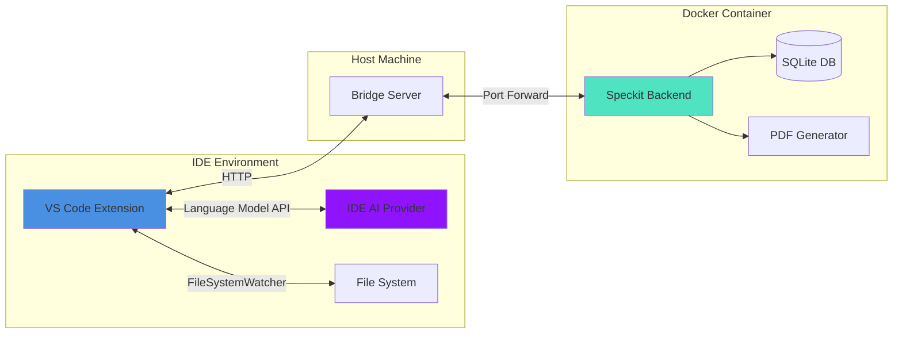
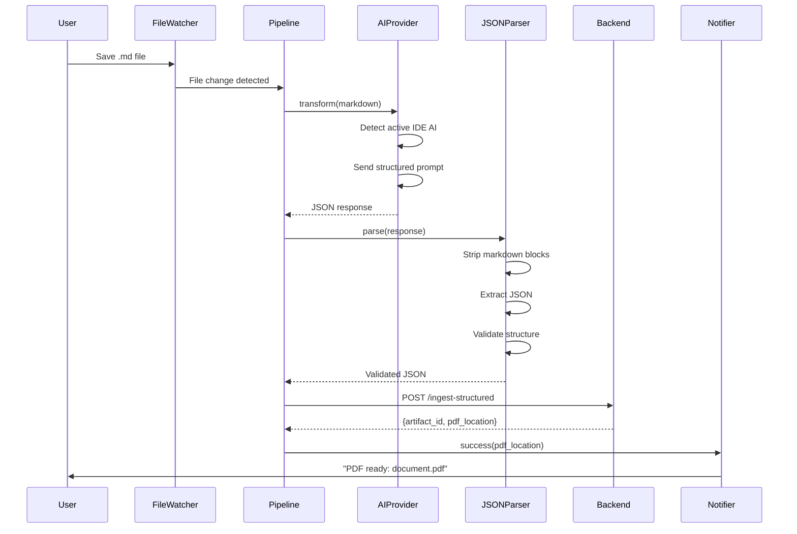

# Design Document: VS Code Speckit Auto-AI Extension

## Overview

The VS Code Speckit Auto-AI Extension is a fully automatic documentation generation system that transforms markdown files into professional PDFs without manual intervention. The extension leverages the IDE's active AI model (GitHub Copilot, Claude Dev, Kiro, or Cursor) to intelligently structure raw markdown into formal documentation, eliminating the need for separate API keys or configuration.

### Key Innovation

Unlike traditional documentation tools that require manual triggers or external AI APIs, this extension provides a **zero-friction experience**: developers simply save markdown files, and the system automatically detects, transforms, and generates PDFs using whatever AI model is already active in their IDE.

### Design Goals

1. **Zero Configuration**: Works immediately after installation with sensible defaults
2. **IDE-Agnostic AI**: Uses the developer's existing AI subscription (Copilot, Claude, etc.)
3. **Fully Automatic**: No manual commands or triggers required
4. **Robust Parsing**: Handles AI response variations gracefully
5. **Performance**: Processes files within 10 seconds without blocking the IDE
6. **Extensibility**: Architecture supports multiple IDEs (VS Code, Cursor, future platforms)

## Architecture

### High-Level Component Diagram



### System Context



### Data Flow Sequence



## Components and Interfaces

### 1. Extension Entry Point (`extension.ts`)

**Responsibility**: Extension lifecycle management and coordination

**Key Functions**:
- `activate(context)`: Initialize all services and start file watching
- `deactivate()`: Clean up resources and stop watchers

**Dependencies**: All service components

**State**:
- `isActivated`: boolean
- `activeWatchers`: FileSystemWatcher[]
- `processingQueue`: Map<string, Promise>

### 2. FileWatcher (`fileWatcher.ts`)

**Responsibility**: Monitor workspace for markdown file changes

**Interface**:
```typescript
interface FileWatcher {
  start(): Promise<void>;
  stop(): Promise<void>;
  onFileChanged(callback: (uri: vscode.Uri) => void): void;
  onFileCreated(callback: (uri: vscode.Uri) => void): void;
}
```

**Implementation Details**:
- Uses `vscode.workspace.createFileSystemWatcher('**/*.md')`
- Debounces events with 500ms delay to batch rapid saves
- Maintains ignore patterns: `**/node_modules/**`, `**/.git/**`, `**/.vscode/**`, `**/.ai-requests/**`, `**/.ai-responses/**`
- Implements smart duplicate detection to avoid processing the same file multiple times

**Configuration**:
```typescript
interface FileWatcherConfig {
  includePatterns: string[];  // Default: ['**/*.md']
  excludePatterns: string[];  // Default: node_modules, .git, etc.
  debounceMs: number;          // Default: 500
}
```

### 3. AIProvider (`aiProvider.ts`)

**Responsibility**: Abstract interface to IDE AI models with fallback chain

**Interface**:
```typescript
interface AIProvider {
  isAvailable(): Promise<boolean>;
  getProviderName(): string;
  transform(markdown: string, sourcePath: string): Promise<StructuredJSON>;
}

interface StructuredJSON {
  title: string;
  abstract: string;
  sections: Section[];
  artifact_type: string;
}

interface Section {
  heading: string;
  content: string;
  type: 'task' | 'user_story' | 'design_decision' | 'normal';
}
```

**Provider Detection Strategy**:
```typescript
class AIProviderFactory {
  async detectProviders(): Promise<AIProvider[]> {
    const providers: AIProvider[] = [];
    
    // 1. Try GitHub Copilot
    const copilotModels = await vscode.lm.selectChatModels({
      vendor: 'copilot',
      family: 'gpt-4'
    });
    if (copilotModels.length > 0) {
      providers.push(new CopilotProvider(copilotModels[0]));
    }
    
    // 2. Try Claude (Anthropic)
    const claudeModels = await vscode.lm.selectChatModels({
      vendor: 'anthropic'
    });
    if (claudeModels.length > 0) {
      providers.push(new ClaudeProvider(claudeModels[0]));
    }
    
    // 3. Try any available model
    const anyModels = await vscode.lm.selectChatModels();
    if (anyModels.length > 0) {
      providers.push(new GenericProvider(anyModels[0]));
    }
    
    // 4. Fallback to rule-based
    providers.push(new RuleBasedProvider());
    
    return providers;
  }
}
```

**Prompt Engineering**:

The system uses a carefully crafted prompt to ensure consistent, high-quality transformations across different AI providers:

```typescript
const SYSTEM_PROMPT = `You are an expert documentation agent specializing in technical specification analysis.

Your task is to transform raw markdown documents into well-structured, professional documentation with:

1. **Title**: Extract or generate a clear, descriptive title
   - Use first heading if meaningful
   - Improve generic titles (e.g., "spec" → "Feature Specification")
   - Keep technical accuracy

2. **Abstract**: Create a concise summary (2-3 sentences)
   - Capture document's main purpose
   - Highlight key points or scope
   - Be specific, not generic

3. **Sections**: Intelligently classify each section
   - **task**: Contains action items, todos, or implementation steps
   - **user_story**: User-facing requirements or personas
   - **design_decision**: Architecture, design choices, or technical decisions
   - **normal**: General content, descriptions, or background

4. **Preserve content**: Keep original markdown structure, just enhance metadata

Return valid JSON in this exact format:
{
  "title": "Clear Document Title",
  "abstract": "Brief 2-3 sentence summary of the document's purpose and scope.",
  "sections": [
    {
      "heading": "Section Name",
      "content": "Full section content preserved",
      "type": "task|user_story|design_decision|normal"
    }
  ]
}`;
```

### 4. TransformPipeline (`transformPipeline.ts`)

**Responsibility**: Orchestrate the complete transformation workflow with error handling and retries

**Interface**:
```typescript
interface TransformPipeline {
  process(fileUri: vscode.Uri): Promise<ProcessResult>;
}

interface ProcessResult {
  success: boolean;
  artifactId?: number;
  pdfLocation?: string;
  error?: Error;
  provider?: string;
}
```

**Processing Workflow**:
```typescript
class TransformPipeline {
  async process(fileUri: vscode.Uri): Promise<ProcessResult> {
    try {
      // Step 1: Read file content
      const content = await this.readFile(fileUri);
      
      // Step 2: Check for duplicate processing
      if (await this.isDuplicate(fileUri, content)) {
        return { success: true, skipped: true };
      }
      
      // Step 3: Transform with AI
      const structured = await this.aiProvider.transform(
        content, 
        this.getRelativePath(fileUri)
      );
      
      // Step 4: Parse and validate JSON
      const validated = await this.jsonParser.parseAndValidate(structured);
      
      // Step 5: Send to backend
      const result = await this.backendClient.ingest(validated);
      
      // Step 6: Notify user
      await this.notifier.success(result);
      
      return { 
        success: true, 
        artifactId: result.artifact_id,
        pdfLocation: result.pdf_location,
        provider: this.aiProvider.getProviderName()
      };
      
    } catch (error) {
      await this.notifier.error(error);
      return { success: false, error };
    }
  }
  
  private async isDuplicate(uri: vscode.Uri, content: string): Promise<boolean> {
    const hash = this.computeHash(content);
    const cached = this.cache.get(uri.fsPath);
    return cached === hash;
  }
}
```

### 5. JSONParser (`jsonParser.ts`)

**Responsibility**: Robust parsing and validation of AI-generated JSON responses

**Interface**:
```typescript
interface JSONParser {
  parse(response: string): StructuredJSON;
  validate(json: StructuredJSON): ValidationResult;
  parseAndValidate(response: string): StructuredJSON;
  prettyPrint(json: StructuredJSON): string;
}

interface ValidationResult {
  valid: boolean;
  errors: string[];
  warnings: string[];
}
```

**Parsing Strategy**:

The parser implements a multi-stage approach to handle AI response variations:

1. **Strip Markdown Code Blocks**: Remove ```json and ``` delimiters
2. **Trim Whitespace**: Clean leading/trailing spaces
3. **Extract JSON**: Find content between first `{` and last `}`
4. **Parse**: Use `JSON.parse()` with error handling
5. **Repair**: Attempt common fixes if parsing fails
6. **Validate**: Ensure required fields are present

```typescript
class JSONParser {
  parse(response: string): StructuredJSON {
    let cleaned = response.trim();
    
    // Stage 1: Strip markdown code blocks
    if (cleaned.startsWith('```')) {
      const lines = cleaned.split('\n');
      cleaned = lines.slice(1, -1).join('\n').trim();
    }
    
    // Stage 2: Extract JSON between braces
    const firstBrace = cleaned.indexOf('{');
    const lastBrace = cleaned.lastIndexOf('}');
    if (firstBrace !== -1 && lastBrace !== -1) {
      cleaned = cleaned.substring(firstBrace, lastBrace + 1);
    }
    
    // Stage 3: Attempt parsing
    try {
      return JSON.parse(cleaned);
    } catch (e) {
      // Stage 4: Repair and retry
      return this.repairAndParse(cleaned);
    }
  }
  
  private repairAndParse(json: string): StructuredJSON {
    // Common repairs:
    // - Remove trailing commas
    // - Fix unescaped quotes in strings
    // - Add missing closing braces
    
    let repaired = json
      .replace(/,(\s*[}\]])/g, '$1')  // Remove trailing commas
      .replace(/([^\\])"/g, '$1\\"'); // Escape unescaped quotes
    
    return JSON.parse(repaired);
  }
  
  validate(json: StructuredJSON): ValidationResult {
    const errors: string[] = [];
    
    if (!json.title || typeof json.title !== 'string') {
      errors.push('Missing or invalid title');
    }
    
    if (!json.abstract || typeof json.abstract !== 'string') {
      errors.push('Missing or invalid abstract');
    }
    
    if (!Array.isArray(json.sections)) {
      errors.push('Missing or invalid sections array');
    } else {
      json.sections.forEach((section, i) => {
        if (!section.heading) {
          errors.push(`Section ${i}: missing heading`);
        }
        if (!section.content) {
          errors.push(`Section ${i}: missing content`);
        }
        if (!['task', 'user_story', 'design_decision', 'normal'].includes(section.type)) {
          errors.push(`Section ${i}: invalid type "${section.type}"`);
        }
      });
    }
    
    return { valid: errors.length === 0, errors, warnings: [] };
  }
}
```

### 6. BackendClient (`backendClient.ts`)

**Responsibility**: HTTP communication with Speckit backend API

**Interface**:
```typescript
interface BackendClient {
  ingest(data: StructuredJSON): Promise<IngestResponse>;
  checkHealth(): Promise<boolean>;
}

interface IngestResponse {
  status: string;
  artifact_id: number;
  pdf_location: string;
  version: number;
}
```

**Implementation**:
```typescript
class BackendClient {
  private baseUrl: string;
  private apiKey: string;
  private maxRetries: number = 3;
  
  async ingest(data: StructuredJSON): Promise<IngestResponse> {
    const url = `${this.baseUrl}/api/artifacts/ingest-structured`;
    
    const payload = {
      project_id: this.getProjectName(),
      source_path: data.source_path,
      structured_json: data,
      commit_hash: await this.getCommitHash()
    };
    
    return this.retryWithBackoff(async () => {
      const response = await fetch(url, {
        method: 'POST',
        headers: {
          'Content-Type': 'application/json',
          'Authorization': `Bearer ${this.apiKey}`
        },
        body: JSON.stringify(payload)
      });
      
      if (!response.ok) {
        throw new Error(`Backend error: ${response.status} ${response.statusText}`);
      }
      
      return response.json();
    });
  }
  
  private async retryWithBackoff<T>(
    fn: () => Promise<T>,
    retries: number = this.maxRetries
  ): Promise<T> {
    for (let i = 0; i < retries; i++) {
      try {
        return await fn();
      } catch (error) {
        if (i === retries - 1) throw error;
        await this.sleep(Math.pow(2, i) * 1000); // 1s, 2s, 4s
      }
    }
    throw new Error('Max retries exceeded');
  }
}
```

### 7. NotificationService (`notificationService.ts`)

**Responsibility**: User feedback and status updates

**Interface**:
```typescript
interface NotificationService {
  processing(fileName: string): void;
  success(result: IngestResponse): void;
  error(error: Error): void;
  progress(current: number, total: number): void;
}
```

**Implementation Strategy**:
- Success notifications include clickable link to open PDF
- Error notifications include "Show Details" button to open extension logs
- Rate limiting: Max 1 success notification per 10 seconds
- Aggregate progress for bulk operations

### 8. ConfigurationManager (`config.ts`)

**Responsibility**: Extension settings management

**Configuration Schema**:
```typescript
interface ExtensionConfig {
  backendUrl: string;           // Default: 'http://localhost:8000'
  autoProcess: boolean;          // Default: true
  includePatterns: string[];     // Default: ['**/*.md']
  excludePatterns: string[];     // Default: ['**/node_modules/**', ...]
  apiKey: string;                // Default: 'dev-key'
  enableDebugLogging: boolean;   // Default: false
  debounceMs: number;            // Default: 500
  maxConcurrentProcessing: number; // Default: 3
}
```

**VS Code Settings Contribution**:
```json
{
  "configuration": {
    "title": "Speckit Auto-AI",
    "properties": {
      "speckit.backendUrl": {
        "type": "string",
        "default": "http://localhost:8000",
        "description": "Speckit backend API URL"
      },
      "speckit.autoProcess": {
        "type": "boolean",
        "default": true,
        "description": "Automatically process markdown files on save"
      },
      "speckit.includePatterns": {
        "type": "array",
        "default": ["**/*.md"],
        "description": "Glob patterns for files to process"
      },
      "speckit.excludePatterns": {
        "type": "array",
        "default": [
          "**/node_modules/**",
          "**/.git/**",
          "**/.vscode/**",
          "**/.ai-requests/**",
          "**/.ai-responses/**"
        ],
        "description": "Glob patterns for files to ignore"
      }
    }
  }
}
```

## Data Models

### StructuredJSON

The core data structure for document representation:

```typescript
interface StructuredJSON {
  title: string;              // Document title (required)
  abstract: string;           // 2-3 sentence summary (required)
  sections: Section[];        // Document sections (required)
  artifact_type?: string;     // Document type classification (optional)
  source_path: string;        // Relative file path (required)
  ai_enhanced: boolean;       // Whether AI transformation was used (required)
  agent_source?: string;      // AI provider name (optional)
}

interface Section {
  heading: string;           // Section heading (required)
  content: string;           // Full markdown content (required)
  type: SectionType;         // Classification (required)
}

type SectionType = 
  | 'task'                   // Action items, todos, implementation steps
  | 'user_story'             // User requirements, personas
  | 'design_decision'        // Architecture, technical choices
  | 'normal';                // General content, descriptions
```

### Backend API Request

```typescript
interface IngestStructuredRequest {
  project_id: string;         // Project identifier or name
  source_path: string;        // Relative path from workspace root
  structured_json: StructuredJSON;
  commit_hash?: string;       // Git commit hash (optional)
}
```

### Backend API Response

```typescript
interface IngestStructuredResponse {
  status: string;             // 'ok' or 'error'
  artifact_id: number;        // Database ID of created artifact
  pdf_location: string;       // Relative path to generated PDF
  version: number;            // Version number of the artifact
  skipped?: boolean;          // True if duplicate was detected
  enhancements?: {            // Document enhancements applied
    diagrams_added: number;
    sections_enhanced: number;
  };
}
```

### Extension State

```typescript
interface ExtensionState {
  isActivated: boolean;
  aiProvider: AIProvider | null;
  processingQueue: Map<string, Promise<ProcessResult>>;
  cache: Map<string, string>;  // File path -> content hash
  lastNotificationTime: number;
  config: ExtensionConfig;
}
```

